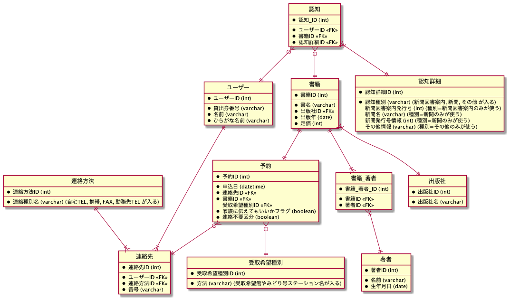

# 作業の記録

## 1. イベントを見出す

- 予約
- 認知

## 2. リソース系を抜き出す

- 書籍
- ユーザー
- 認知種別

## 3. 項目を入れていく

- 予約 (〜する)
  - 申込日
  - 貸出券番号
- 認知 (〜する)
  - 種別
- 書籍 (何を)
  - 書名
  - 著者
  - 出版社
  - 出版年
- ユーザー (誰が)
  - 名前
  - ひらがな名前
  - 連絡方法
    - 連絡種別
    - 番号

## 4. リレーションシップを設定する

**正規化**

- 予約 (〜する)
  - 予約 ID
  - 申込日
  - 貸出券番号
  - ユーザ ID <<FK>>
  - 書籍 ID <<FK>>
  - 受取希望種別 ID <<FK>>
  - 家族に伝えてもいいかフラグ
- 認知 (〜する)
  - 認知 ID
  - 種別
  - 新聞図書案内発行号情報 -- 種別=新聞図書案内のみが使う
  - 新聞名 -- 種別=新聞のみが使う
  - 新聞発行号情報 -- 種別=新聞のみが使う
  - その他情報 -- 種別=その他のみが使う
- 認知\_ユーザー\_書籍
  - 認知\_ユーザー\_書籍 ID
  - 認知 ID <<FK>>
  - ユーザー ID <<FK>>
  - 書籍 ID <<FK>>
- 書籍 (何を)
  - 書籍 ID
  - 書名
  - 出版社 ID <<FK>>
  - 出版年
  - 定価
- 著者
  - 著者 ID
  - 名前
  - 生年月日
- 書籍\_著者
  - 書籍\_著者 ID
  - 書籍 ID <<FK>>
  - 著者 ID <<FK>>
- 書籍\_著者
  - 書籍\_著者 ID
  - 書籍 ID <<FK>>
  - 著者 ID <<FK>>
- 出版社
  - 出版社 ID
  - 出版社名
- ユーザー (誰が)
  - ユーザー ID
  - 名前
  - ひらがな名前
- 連絡方法
  - 連絡方法 ID
  - 連絡種別名
  - 番号
- ユーザー\_連絡方法
  - ユーザー\_連絡方法 ID
  - ユーザー ID <<FK>>
  - 連絡方法 ID <<FK>>
- 受取希望種別
  - 受取希望種別 ID
  - 方法

**リレーション**

```wsd
ユーザー ||--|| 予約
予約 ||--|| 書籍
予約 }|--|| 受取希望種別
ユーザー ||--|{ 認知_ユーザー_書籍
認知_ユーザー_書籍 }|--|| 書籍
認知_ユーザー_書籍 }|--|| 認知
書籍 ||--|{ 書籍_著者
書籍_著者 }|--|| 著者
書籍 }|--|| 出版社
ユーザー ||--|{ ユーザー_連絡方法
ユーザー_連絡方法 }|--|| 連絡方法
```


## 5. SQL を考える

クエリを生成してくれるツール使った方が早い気がする。

## 6. リファクタリング

- 答え合わせして、回答と異なっていた点
  - 連絡方法
    - 予約のたびに変わるなら、予約の付帯情報
    - 毎回同じで良いのなら、予約者の付帯情報
  - 不要
  - 貸出券番号


