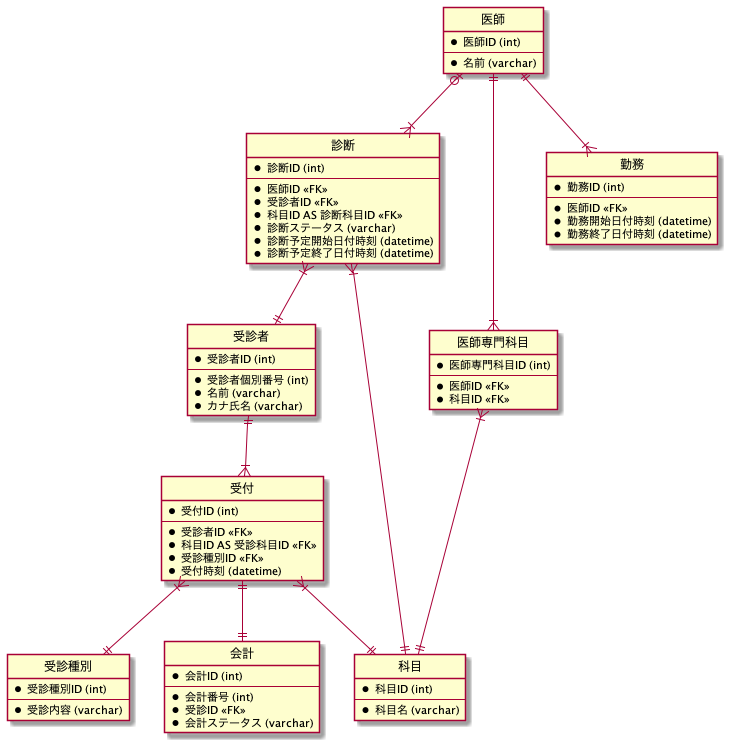
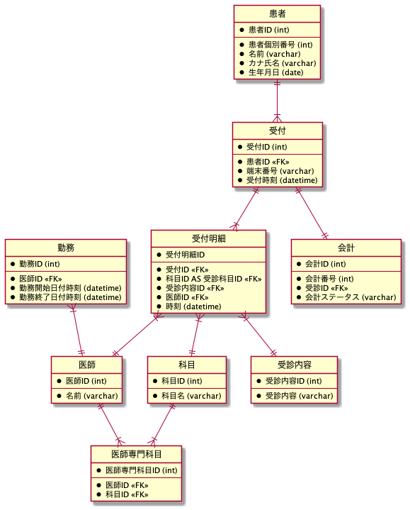
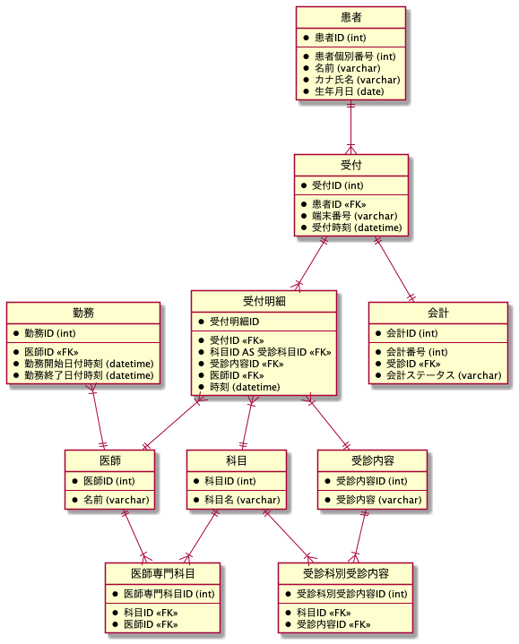

# 作業の記録

## 1. イベントを見出す

```wsd
entity 受付 {
}

entity 診断 {
}
```

## 2. リソース系を抜き出す

```wsd
entity 受付 {
}

entity 受診者 {
}

entity 診断 {
}

entity 医師 {
}
```

## 3. 項目を入れていく

```wsd
entity 受付 {
  *受付ID
  --
  *受診者ID <<FK>>
  *診療科ID <<FK>>
  *受診内容ID <<FK>>
  *受付時刻
}

entity 受診者 {
  *受診者ID
  --
  *受診者個別番号
  *名前
  *カナ氏名
}

entity 診断 {
  *診断ID
  --
  *医師ID <<FK>>
  *受診者ID <<FK>>
  *診断ステータス
  *診断予定時刻
  *診断終了時刻
}

entity 医師 {
  *医師ID
  --
  *名前
  *診療科ID <<FK>>
}

entity 診療科 {
  *診療科ID
  --
  *診療科名
}

entity 会計 {
  *会計ID
  --
  *会計番号
  *受診ID <<FK>>
  *会計ステータス
}

entity 勤務 {
  *勤務ID
  --
  *医師ID <<FK>>
  *勤務開始日付時刻
  *勤務終了日付時刻
}
```

## 4. リレーションシップを設定する



## 5. SQL を考える

スルー

## 6. リファクタリング

- 見出し明細形式に変更
- `医師 <-> 診断 <-> 患者` のリレーションを `受診 <-> 受診明細 <-> 医師` のリレーションに変更



## 7. リファクタリング 2

- 科目別と受診内容の交差テーブルを作成。なぜなら、受診科ごとに受診可能な内容が異なるからだ。


